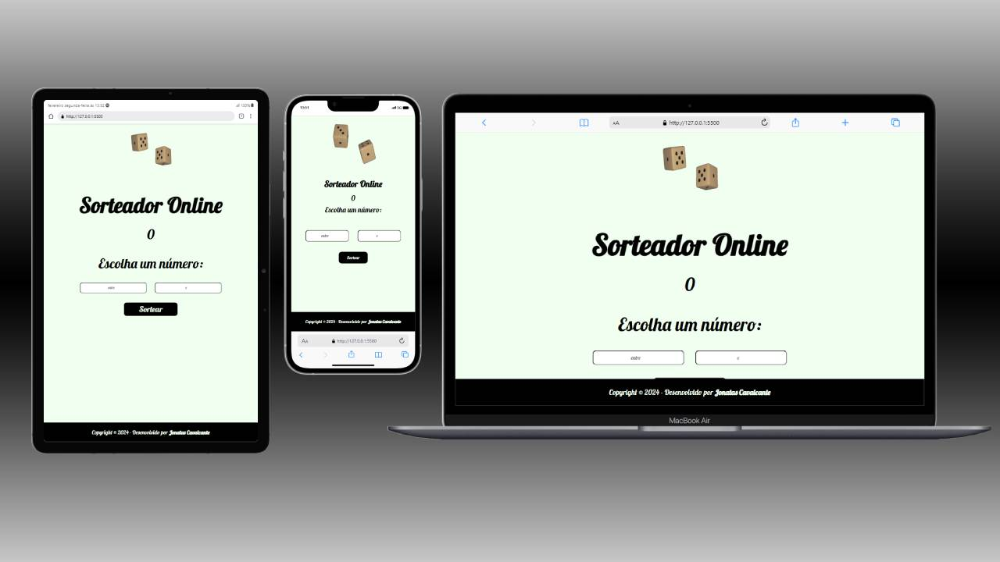

# Projeto-Sorteador

<h1>Projeto Sorteador</h1>

## 📝 Sobre

Neste Projeto Simples, pude praticar o getRandomIntInclusive que permitiu que minha função escolhesse dois números aleatórios inslusive os números entre quais seriam escolhidos.

In this Simple Project, I could pratice the getRandomIntInclusive that allowed my Function
choice a aleatory number between two, inclusive them.

## 🖥 Tecnologias

Neste Projeto Foram utilizados Html, Css e Javascript.

In this project were used Html, Css and Javascript.

